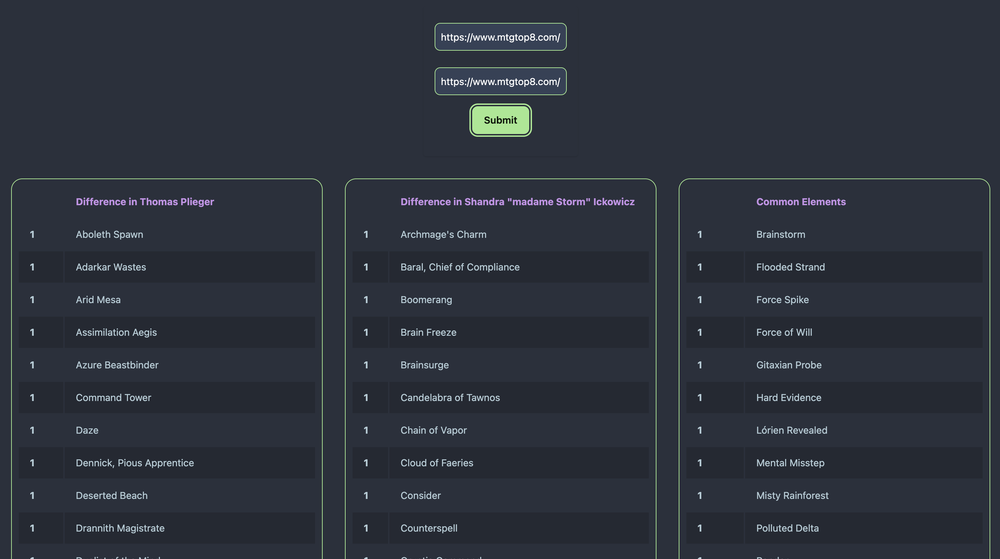

# MtgTop8 List Comparator

## Description
A tool developed in **Go** and **HTMX** to help **Magic: The Gathering** players easily compare card lists from a deck listing site.

## Main Features
- **Automatic comparison** of card lists.
- **Fast and lightweight interface** powered by HTMX.
- **Optimized display** for clear list differences.
- **Identifies missing or extra cards** in decks.

## Technologies Used
- **Backend**: Go (`net/http`)
- **Frontend**: HTMX, HTML/CSS/TailwindCSS

## Installation & Usage

### Installation
1. **Clone the repository**:
   ```bash
   git clone https://github.com/LealKevin/MtgTop8-list-compare.git
   cd MtgTop8-list-compare
   ```

2. **Install dependencies and run the project**:
   ```bash
   go run main.go
   ```

## Project Preview (Screenshots)


## Live Demo
**Live Demo**: [mtgtop8-list-compare.onrender.com](https://mtgtop8-list-compare.onrender.com)

## Contact
**Email**: kevinleal@hotmail.com  
**GitHub**: [LealKevin](https://github.com/LealKevin)
